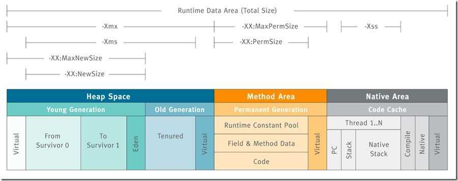

```puml
运行时数据区
	线程共享区域
		堆 Heap
		方法区 Method Area
	线程隔离区域	
		虚拟机栈 VM Stack
		本地方法栈 Native Method Stack
		程序计数器 Program Counter Register
```

# 1 JVM原理
1.1 程序计数器
> 内存空间小，线程私有。字节码解释器的工作就是通过改变这个计数器的值来选取下一条需要执行执行的字节码指令，分支、循环、跳转、异常处理、线程恢复等基础功能都需要依赖计数器完成

如果线程正在执行一个Java方法，这个计数器记录的是正在执行的虚拟机字节码指令的地址；如果正在执行的是Native方法，这个计数器的值为Undefined。此内存区域是唯一一个在Java虚拟机规范中没有规定任何OutOfMemoryError情况的区域

1.2 Java虚拟机栈
> 线程私有，生命周期和线程一致。描述的是Java方法执行的内存模型：每个方法在执行时都会创建一个栈帧（Stack Frame）用于存储局部变量表、操作数栈、动态链接、方法出口等信息。每一个方法从调用直至执行结束，就对应着一个栈帧从虚拟机栈中入栈到出栈的过程

局部变量表：存放了编译器可知的各种基本类型（byte、short、int、long、boolean、char、float、double）、对象引用（reference类型）、returnAddress类型（指向了一条字节码指令的地址）

StackOverflowError: 线程请求的栈深度大于虚拟机所允许的深度
OutOfMemoryError: 	如果虚拟机栈可以动态扩展，而扩展时无法申请到足够的内存

1.3 本地方法栈
> 区别于Java虚拟机栈的是，Java虚拟机栈为虚拟机执行Java方法（字节码）服务，而本地方法栈则为虚拟机使用到的Native方法服务。也会有StackOverflowError和OutOfMemoryError异常

1.4 Java堆
> 对于绝大多数应用来说，这块区域是JVM所管理的内存中最大的一块。线程共享，主要是存放对象实例和数组。内部会划分出多个线程私有的分配缓存（Thread Local Allocation Buffer，TLAB）。可以位于物理上不连续的空间，但是逻辑上要连续。

可利用参数-Xms -Xmx进行堆内存控制

OutOfMemoryError：如果堆中没有内存完成实例分配，并且堆也无法再扩展时，抛出该异常。

1.5 方法区
> 属于共享内存区域，存储已被虚拟机加载的类信息、常量、静态变量、即时编译器编译后的代码等数据

JDK1.7
	这块区域被称为永久代，
	可以利用参数-XX:PermSize -XX:MaxPermSize 来控制初始容量和最大容量

JDK1.8
	移除永久代，并使用了一个元空间的区域 Metaspace
	可以使用-XX:MaxMetaspaceSize来控制最大内存

1.6 运行时常量池
> 属于方法区一部分，用于存放编译期生成的各种字面量和符号引用。编译器和运行期(String 的 intern() )都可以将常量放入池中。内存有限，无法申请时抛出 OutOfMemoryError

当new一个对象时，会检查这个区域是否有这个符号的引用。

1.7 直接内存
> Direct Memory，堆外内存，非虚拟机运行时数据区的部分

JDK1.4以后加入NIO，引入了一种基于通道（Channel）和缓存（Buffer）的I/O方式，它可以使用Native函数库直接分配堆外内存，然后通过一个存储在Java堆中的DirectByteBuffer对象作为这块内存的引用进行操作。可以避免在Java堆和Native堆中来回的数据耗时操作。
OutOfMemoryError： 会受到本机内存限制，

Netty中所有的IO/NIO操作都会通过Native函数直接分配堆外内存，它是通过DirectByteBuffer对象操作的堆外内存，避免了堆内存和堆外内存的来回复制交换复制，这样的高效操作也被称为“零拷贝”。

既然是内存，那也得是可以被回收的。但由于堆外内存不直接受 JVM 管理，所以常规 GC 操作并不能回收堆外内存。它是借助于老年代产生的 fullGC 顺便进行回收。同时也可以显式调用 System.gc() 方法进行回收（前提是没有使用 -XX:+DisableExplicitGC 参数来禁止该方法）。

### JVM常用参数



常见的如下：

    -Xms64m 最小堆内存 64m.
    -Xmx128m 最大堆内存 128m.
    -XX:NewSize=30m 新生代初始化大小为30m.
    -XX:MaxNewSize=40m 新生代最大大小为40m.
    -Xss=256k 线程栈大小。
    -XX:+PrintHeapAtGC 当发生 GC 时打印内存布局。
    -XX:+HeapDumpOnOutOfMemoryError 发送内存溢出时 dump 内存。

1.8 HotSpot虚拟机对象

1.8.1 对象的创建
遇到 new 指令时，首先检查这个指令的参数是否能在常量池中定位到一个类的符号引用，并且检查这个符号引用代表的类是否已经被加载、解析和初始化过。如果没有，执行相应的类加载。

类加载检查通过之后，为新对象分配内存(内存大小在类加载完成后便可确认)。在堆的空闲内存中划分一块区域(‘指针碰撞-内存规整’或‘空闲列表-内存交错’的分配方式)。

前面讲的每个线程在堆中都会有私有的分配缓冲区(TLAB)，这样可以很大程度避免在并发情况下频繁创建对象造成的线程不安全。

内存空间分配完成后会初始化为 0(不包括对象头)，接下来就是填充对象头，把对象是哪个类的实例、如何才能找到类的元数据信息、对象的哈希码、对象的 GC 分代年龄等信息存入对象头。

执行 new 指令后执行 init 方法后才算一份真正可用的对象创建完成。

1.8.2 对象的内存布局
> 在 HotSpot 虚拟机中，分为 3 块区域：对象头(Header)、实例数据(Instance Data)和对齐填充(Padding)

对象头(Header)：包含两部分，第一部分用于存储对象自身的运行时数据，如哈希码、GC 分代年龄、锁状态标志、线程持有的锁、偏向线程 ID、偏向时间戳等，32 位虚拟机占 32 bit，64 位虚拟机占 64 bit。官方称为 ‘Mark Word’。第二部分是类型指针，即对象指向它的类的元数据指针，虚拟机通过这个指针确定这个对象是哪个类的实例。另外，如果是 Java 数组，对象头中还必须有一块用于记录数组长度的数据，因为普通对象可以通过 Java 对象元数据确定大小，而数组对象不可以。

实例数据(Instance Data)：程序代码中所定义的各种类型的字段内容(包含父类继承下来的和子类中定义的)

对齐填充(Padding)：不是必然需要，主要是占位，保证对象大小是某个字节的整数倍

1.8.3 对象的访问定位
> 使用对象时，通过栈上的 reference 数据来操作堆上的具体对象
> 通过句柄访问，Java 堆中会分配一块内存作为句柄池。reference 存储的是句柄地址

比较：使用句柄的最大好处是 reference 中存储的是稳定的句柄地址，在对象移动(GC)是只改变实例数据指针地址，reference 自身不需要修改。直接指针访问的最大好处是速度快，节省了一次指针定位的时间开销。如果是对象频繁 GC 那么句柄方法好，如果是对象频繁访问则直接指针访问好。

# 2 垃圾回收与内存分配策略
2.1 垃圾回收器
> 程序计数器、虚拟机栈、本地方法栈3个区域随线程产生和销毁（因为是线程私有），栈中的栈帧随着方法的进入和退出而有条不紊的进行着入栈和出栈操作。而Java堆和方法区则不一样，一个接口的多个实现类需要的内存可能不一样，一个方法的多个分支需要的内存也可能不一样，我们只有程序运行期才知道那些对象会被创建，这部分内存的分配和回收都是动态的，垃圾回收器所关注的就是这部分内存

2.2 对象死亡
> 

2.2.1 引用计数法
> 给对象添加一个引用计数器，但是难以解决循环引用问题，所有JVM没有采用这种算法。

2.2.2 可达性分析法
> 通过一系列的‘GC Roots’ 的对象作为起始点，从这些节点出发所走过的路径称为引用链，当一个对象到 GC Roots 没有任何引用链相连的时候说明对象不可用。

可作为GC Roots的对象：
	1.虚拟机栈（栈帧中的本地变量表）中引用的对象	[虚拟机栈中的对象]
	2.方法区中类静态属性引用的对象			[方法区静态属性引用的对象]
	3.方法区中常量引用的对象					[方法区常量引用的对象]
	4.本地方法栈中JNI（Native方法）引用的对象	[Native方法引用的对象]
	
2.2.3 引用
> 强引用 
> 软引用 SoftReference 类实现软引用。在系统要发生内存溢出异常之前，将会把这些对象列进回收范围之中进行二次回收。
> 弱引用 WeakReference 类实现弱引用。对象只能生存到下一次垃圾收集之前。在垃圾收集器工作时，无论内存是否足够都会回收掉只被弱引用关联的对象。
> 虚引用 PhantomReference 类实现虚引用。无法通过虚引用获取一个对象的实例，为一个对象设置虚引用关联的唯一目的就是能在这个对象被收集器回收时收到一个系统通知。

2.2.4 生存与死亡
> 即使在可达性分析算法中不可达的对象，也并非是“facebook”的，这时候它们暂时出于“缓刑”阶段，一个对象的真正死亡至少要经历两次标记过程：如果对象在进行中可达性分析后发现没有与 GC Roots 相连接的引用链，那他将会被第一次标记并且进行一次筛选，筛选条件是此对象是否有必要执行 finalize() 方法。当对象没有覆盖 finalize() 方法，或者 finalize() 方法已经被虚拟机调用过，虚拟机将这两种情况都视为“没有必要执行”。

> 如果这个对象被判定为有必要执行 finalize() 方法，那么这个对象竟会放置在一个叫做 F-Queue 的队列中，并在稍后由一个由虚拟机自动建立的、低优先级的 Finalizer 线程去执行它。这里所谓的“执行”是指虚拟机会出发这个方法，并不承诺或等待他运行结束。finalize() 方法是对象逃脱死亡命运的最后一次机会，稍后 GC 将对 F-Queue 中的对象进行第二次小规模的标记，如果对象要在 finalize() 中成功拯救自己 —— 只要重新与引用链上的任何一个对象简历关联即可。

finalize() 方法只会被系统自动调用一次。

2.2.5 回收方法区
> 在堆中，尤其是在新生代中，一次垃圾回收一般回收70%-95%的空间，而永久带的垃圾收集效率远低于此
> 永久代垃圾回收主要包括两部分内容: 废弃的常量和无用的类

判断废弃常量：一般是判断没有该常量的引用。

判断无用的类：要以下三个条件都满足

    该类所有的实例都已经回收，也就是 Java 堆中不存在该类的任何实例
    加载该类的 ClassLoader 已经被回收
    该类对应的 java.lang.Class 对象没有任何地方被引用，无法在任何地方通过反射访问该类的方法

2.3 垃圾回收算法

2.3.1 标记-清除算法
> 标记,然后清除
两个不足：
    效率不高
    空间会产生大量碎片

2.3.2 复制算法
> 把空间分成两块，每次只对其中一块进行 GC。当这块内存使用完时，就将还存活的对象复制到另一块上面。
解决前一种方法的不足，但是会造成空间利用率低下。因为大多数新生代对象都不会熬过第一次 GC。所以没必要 1 : 1 划分空间。可以分一块较大的 Eden 空间和两块较小的 Survivor 空间，每次使用 Eden 空间和其中一块 Survivor。当回收时，将 Eden 和 Survivor 中还存活的对象一次性复制到另一块 Survivor 上，最后清理 Eden 和 Survivor 空间。大小比例一般是 8 : 1 : 1，每次浪费 10% 的 Survivor 空间。但是这里有一个问题就是如果存活的大于 10% 怎么办？这里采用一种分配担保策略：多出来的对象直接进入老年代。

2.3.3 标记-整理算法
> 不同于针对新生代的复制算法，针对老年代的特点，创建该算法。主要是把存活对象移到内存的一端。
复制算法如果在存活对象较多时效率明显会降低，特别是在老年代中并没有多余的内存区域可以提供内存担保。

2.3.4 分代回收
> 根据存活对象划分几块内存区，一般是分为新生代和老年代。然后根据各个年代的特点制定相应的回收算法。

现代多数的商用 JVM 的垃圾收集器都是采用的分代回收算法，和之前所提到的算法并没有新的内容。

只是将 Java 堆分为了新生代和老年代。由于新生代中存活对象较少，所以采用复制算法，简单高效。

而老年代中对象较多，并且没有可以担保的内存区域，所以一般采用标记清除或者是标记整理算法。

新生代
> 每次垃圾回收都有大量对象死去，只有少量存活，选用复制算法比较合理。

老年代
> 老年代中对象存活率较高、没有额外的空间分配对它进行担保。所以必须使用 标记 —— 清除 或者 标记 —— 整理 算法回收。

2.5 垃圾回收器
> 收集算法是内存回收的理论，而垃圾回收器是内存回收的实践。

2.5.1 Serial 收集器
> 这是一个单线程的收集器，意味着它只会使用一个CPU或一条收集线程去完成收集工作，并且在进行垃圾回收时必须暂停其它所有的工作线程直到收集结束

2.5.2 ParNew收集器
> 可以认为是Serial收集器的多线程版本

2.5.3 Parallel Scavenge收集器
> 这是一个新生代收集器，也是使用复制算法实现，同时也是并行的多线程收集器。

2.5.4 Serial Old 收集器
> 收集器的老年代版本，单线程，使用 标记 — 整理。

2.5.5 Parallel Old 收集器
> Parallel Old 是 Parallel Scavenge 收集器的老年代版本。多线程，使用 标记 — 整理

2.5.6 CMS 收集器
> CMS (Concurrent Mark Sweep) 收集器是一种以获取最短回收停顿时间为目标的收集器。基于 标记 —— 清除 算法实现。
运作步骤:
    初始标记(CMS initial mark)：标记 GC Roots 能直接关联到的对象
    并发标记(CMS concurrent mark)：进行 GC Roots Tracing
    重新标记(CMS remark)：修正并发标记期间的变动部分
    并发清除(CMS concurrent sweep)

2.5.7 G1 收集器
> 面向服务端的垃圾回收器。
优点：并行与并发、分代收集、空间整合、可预测停顿。

运作步骤:
    初始标记(Initial Marking)
    并发标记(Concurrent Marking)
    最终标记(Final Marking)
    筛选回收(Live Data Counting and Evacuation)

2.6 内存分配与回收策略

调优：
    1.一个对象引用在栈中占用4byte
    2.基本类型在栈中保存，占用1-8byte
    3.一个空对象在堆中占用8byte,栈中引用占用4byte，Object obj = new Object();
        空对象大小(8byte)+int大小(4byte)+Boolea大小(1byte)+空Object引用的大小(4byte)=17byte。
        但是因为java在对对象内存分配时都是以8的整数倍来分的，因此大于17byte的最接近8的整数倍的是24，因此此对象的大小为24byte       
    4.一个基本类型包装类的大小至少是16byte

典型设置：java -Xmx3550m  -Xms3550m -Xmn2g  -Xss128k

-Xss 设置栈的大小
-Xms 设置堆的初始值
-Xmx 设置堆的最大值

垃圾回收：
1.按回收策略划分：
    引用计数
    标记清除
    复制
    标记整理
2.按分区对待划分：
    增量收集
    分代收集 年轻代 老年代 持久代
3.按系统线程划分：
    串行收集
    并行收集
    并发收集

## GC原理
1. 分代回收
采用分治思想，进行代的划分，把不同生命周期的对象放在不同的代上，不同代上采用最合适它的垃圾回收方式进行回收。
2. GC回收
GC有Scavenge GC(新生代回收)和Full GC(整个堆回收)。应该尽量减少Full GC的次数，在对JVM调优的过程中，很大一部分工作就是对于Full GC的调节。
* 如下原因可能导致Full GC：
Old Gen满、Perm Gen满、System.gc()调用、上次GC之后Heap的各域分配策略动态变化。
* 常用的GC收集器：
串行收集器 	-XX:+UseSerialGC
并行收集器		-XX:+UseParallelOldGC
并发收集器		-XX:+UseConcMarkSweepGC
* 基本算法：
标记-清除算法
复制算法
标记-整理算法
分代收集算法

## 类加载机制
1. 双亲委派模型
	> 当一个类收到了类加载请求时: 自己不会首先加载，而是委派给父加载器进行加载，每个层次的加载器都是这样
	
	启动类加载器
	扩展类加载器
	应用类加载器
	自定义类加载器
	
	双亲委派模型中除了启动类加载器之外其余都需要有自己的父类加载器

	当一个类收到了类加载请求时: 自己不会首先加载，而是委派给父加载器进行加载，每个层次的加载器都是这样。

	所以最终每个加载请求都会经过启动类加载器。只有当父类加载返回不能加载时子加载器才会进行加载。

	双亲委派的好处 : 由于每个类加载都会经过最顶层的启动类加载器，比如 java.lang.Object这样的类在各个类加载器下都是同一个类(只有当两个类是由同一个类加载器加载的才有意义，这两个类才相等。)

	如果没有双亲委派模型，由各个类加载器自行加载的话。当用户自己编写了一个 java.lang.Object类，那样系统中就会出现多个 Object，这样 Java 程序中最基本的行为都无法保证，程序会变的非常混乱。

2. 类加载器

	> 概念：Java类加载器的作用是运行时加载类。
	
	Java源代码通过javac编译器编译成类文件；
	JVM执行类文件中的字节码来执行程序；
	类加载器负责加载文件系统、网络或其他来源的类文件。
	
	有三种类型的类加载器：
		
		Bootstrap类加载器			
			Bootstrap类加载器负责加载rt.jar中的JDK类文件，它是所有类加载器的父加载器。Bootstrap类加载器没有任何父类加载器，如果你调用String.class.getClassLoader()，会返回null，任何基于此的代码会抛出NUllPointerException异常。
			Bootstrap加载器被称为初始类加载器。
			
		Extension类加载器
			Extension将加载类的请求先委托给它的父加载器，也就是Bootstrap，如果没有成功加载的话，再从jre/lib/ext目录下或者java.ext.dirs系统属性定义的目录下加载类。
			Extension加载器由sun.misc.Launcher$ExtClassLoader实现。
			
		Application类加载器
			Application类加载器负责从classpath环境变量中加载某些应用相关的类，classpath环境变量通常由-classpath或-cp命令行选项来定义，或者是JAR中的Manifest的classpath属性。
			Application类加载器是Extension类加载器的子加载器。通过sun.misc.Launcher$AppClassLoader实现
			
Java类加载器基于三个机制：委托、可见性和单一性。			 		
	
	委托机制是指将加载一个类的请求交给父类加载器，如果这个父类加载器不能够找到或者加载这个类，那么再加载它。
	可见性的原理是子类的加载器可以看见所有的父类加载器加载的类，而父类加载器看不到子类加载器加载的类。
	单一性原理是指仅加载一个类一次，这是由委托机制确保子类加载器不会再次加载父类加载器加载过的类。
	
### 对象创建与内存分配

1. 创建对象
	> 当 JVM 收到一个 new 指令时，会检查指令中的参数在常量池是否有这个符号的引用，还会检查该类是否已经被加载过了，如果没有的话则要进行一次类加载。

	接着就是分配内存了，通常有两种方式：

		指针碰撞
		空闲列表
		
	使用指针碰撞的前提是堆内存是完全工整的，用过的内存和没用的内存各在一边每次分配的时候只需要将指针向空闲内存一方移动一段和内存大小相等区域即可。

	当堆中已经使用的内存和未使用的内存互相交错时，指针碰撞的方式就行不通了，这时就需要采用空闲列表的方式。
	虚拟机会维护一个空闲的列表，用于记录哪些内存是可以进行分配的，分配时直接从可用内存中直接分配即可。	
	
	堆中的内存是否工整是有垃圾收集器来决定的，如果带有压缩功能的垃圾收集器就是采用指针碰撞的方式来进行内存分配的。
	
	分配内存时也会出现并发问题:

	这样可以在创建对象的时候使用 CAS 这样的乐观锁来保证。

	也可以将内存分配安排在每个线程独有的空间进行，每个线程首先在堆内存中分配一小块内存，称为本地分配缓存(TLAB : Thread Local Allocation Buffer)。

	分配内存时，只需要在自己的分配缓存中分配即可，由于这个内存区域是线程私有的，所以不会出现并发问题。

	可以使用 -XX:+/-UseTLAB 参数来设定 JVM 是否开启 TLAB 。

	内存分配之后需要对该对象进行设置，如对象头。
	
2. 对象访问
	> 一个对象被创建之后自然是为了使用，在 Java 中是通过栈来引用堆内存中的对象来进行操作的。

	对于我们常用的 HotSpot 虚拟机来说，这样引用关系是通过直接指针来关联的。
	
	这样的好处就是：在 Java 里进行频繁的对象访问可以提升访问速度(相对于使用句柄池来说)。
	
3. 内存分配

	Eden 区分配
	
		简单的来说对象都是在堆内存中分配的，往细一点看则是优先在 Eden 区分配。

		这里就涉及到堆内存的划分了，为了方便垃圾回收，JVM 将堆内存分为新生代和老年代。

		而新生代中又会划分为 Eden 区，from Survivor、to Survivor 区。

		其中 Eden 和 Survivor 区的比例默认是 8:1:1，当然也支持参数调整 -XX:SurvivorRatio=8。

		当在 Eden 区分配内存不足时，则会发生 minorGC ，由于 Java 对象多数是朝生夕灭的特性，所以 minorGC 通常会比较频繁，效率也比较高。

		当发生 minorGC 时，JVM 会根据复制算法将存活的对象拷贝到另一个未使用的 Survivor 区，如果 Survivor 区内存不足时，则会使用分配担保策略将对象移动到老年代中。

		谈到 minorGC 时，就不得不提到 fullGC(majorGC) ，这是指发生在老年代的 GC ，不论是效率还是速度都比 minorGC 慢的多，回收时还会发生 stop the world 使程序发生停顿，所以应当尽量避免发生 fullGC 。
	
	老年代分配
		
		也有一些情况会导致对象直接在老年代分配，比如当分配一个大对象时(大的数组，很长的字符串)，由于 Eden 区没有足够大的连续空间来分配时，会导致提前触发一次 GC，所以尽量别频繁的创建大对象。

		因此 JVM 会根据一个阈值来判断大于该阈值对象直接分配到老年代，这样可以避免在新生代频繁的发生 GC。

		对于一些在新生代的老对象 JVM 也会根据某种机制移动到老年代中。

		JVM 是根据记录对象年龄的方式来判断该对象是否应该移动到老年代，根据新生代的复制算法，当一个对象被移动到 Survivor 区之后 JVM 就给该对象的年龄记为1，每当熬过一次 minorGC 后对象的年龄就 +1 ，直到达到阈值(默认为15)就移动到老年代中。

		可以使用 -XX:MaxTenuringThreshold=15 来配置这个阈值。


